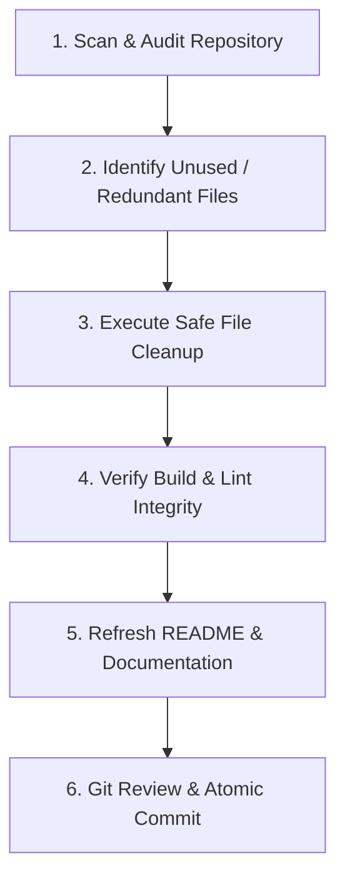

# Repository Cleanup & Documentation Agent Skill

A standardized workflow and automation runbook for cleaning unnecessary files from the codebase and maintaining 100% accurate, up-to-date documentation.

---

## 📋 Workflow Overview



---

## 🔍 Step 1: Scan & Audit Repository

1. **Audit Unreferenced Assets**:
   Run the companion cleanup script to inspect public assets against source code references:
   ```bash
   npm run cleanup:dry
   # or: node .agents/skills/repo-cleanup-docs/scripts/cleanup.mjs --dry-run
   ```
2. **Review Candidate Files**:
   - **Safe to remove**: Duplicate assets, unreferenced temporary mockups, rasterized legacy widget graphics replaced by pure CSS/Tailwind, abandoned test files, leftover OS files (`.DS_Store`, `Thumbs.db`).
   - **Must preserve**: Active components, pages, dynamic routes, brand logos referenced by metadata or manifests, active student cutouts and models (`student-female-cutout.png`, `student-male-cutout.png`, `student-male-tablet.png`), creator profile avatars, files in `public/assets/designs/` used as assessment specs.

---

## 🧹 Step 2: Execute Cleanup

1. Run the cleanup script to remove verified unused files:
   ```bash
   npm run cleanup
   # or: node .agents/skills/repo-cleanup-docs/scripts/cleanup.mjs --fix
   ```
2. Check for leftover scratch files, log files, or temporary build info:
   - Remove `*.tsbuildinfo`, debug logs, or scratch crops.
   - Clean up untracked temporary scripts if no longer required.

---

## 🧪 Step 3: Verify Build & Lint Integrity

Immediately verify that removing candidate files did not break any source code imports or build paths:

1. **Lint Check**:
   ```bash
   npm run lint
   ```
   *Expected outcome*: 0 errors, 0 warnings.

2. **Full Production Build Check**:
   ```bash
   npm run build
   ```
   *Expected outcome*: Next.js App Router static optimization passes for all routes (`/`, `/search`, `/courses`, `/login`, `/register`, `/404`, `/error-404`, `/cart`).

If any import or module error is encountered, immediately restore the required asset.

---

## 📝 Step 4: Synchronize Documentation (`README.md`)

After cleanup, update [README.md](file:///e:/Doin_Tech_Assessments/bytespace-doin_tech/README.md) to reflect the exact state of the repository:

1. **Deliverables Checklist**:
   - Landing Page (`/`)
   - Authentication Suite (`/login`, `/register`)
   - Error 404 Routing (`/error-404`, `/404`, `/_not-found`)
   - Search & Courses Catalog Page (`/search`, `/courses`)
   - Repository Cleanup & Agent Skill (`repo-cleanup-docs`)

2. **Project Directory Tree**:
   - Update the ASCII directory structure to reflect all existing routes, components, and active asset folders.
   - Remove any deleted files from the directory tree in the README.

3. **Asset Inventory**:
   - Document active asset folders and their usage across components.

4. **Commands & Getting Started**:
   - Ensure local setup instructions, script definitions, and testing workflows are accurate.

---

## 📦 Step 5: Git Review & Atomic Commit

1. Review modifications with `git status` and `git diff`.
2. Commit changes atomically with a descriptive conventional commit message:
   ```bash
   git add .
   git commit -m "chore(cleanup): remove unused assets and sync documentation via repo-cleanup-docs skill"
   ```

---

## 📚 References & Resources

- [Cleanup Checklist & Deletion Rules](./references/cleanup-checklist.md)
- [Automated Cleanup Script](./scripts/cleanup.mjs)
